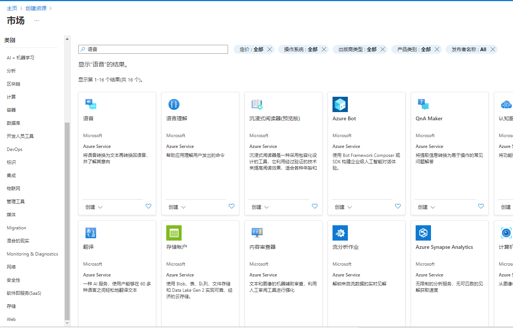
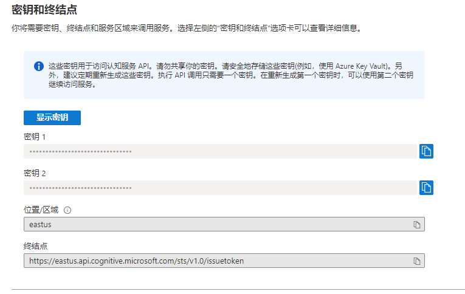
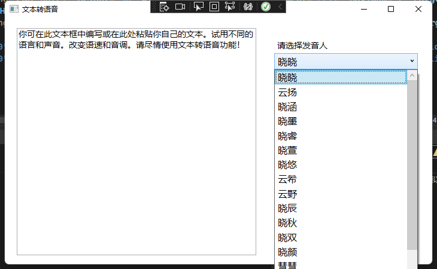
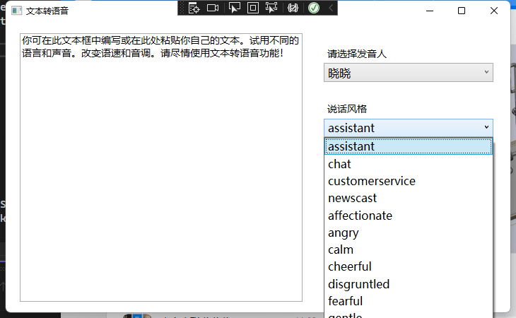
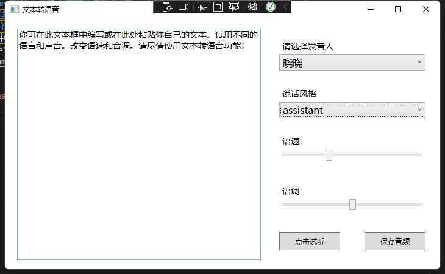
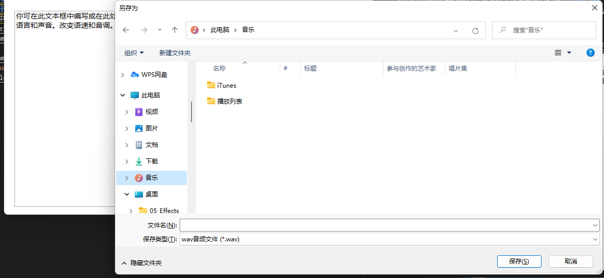

# 这是一款基于微软Axure文字转语音服务封装的文字转语音小程序
- 请先注册[微软Azure服务](https://azure.microsoft.com/zh-cn/)
- 点击创建资源,创建语音服务
 
- 按提示步骤创建完成之后，讲该页面的密钥和地区处填入注册your key和your area
 
```CSharp
/// <summary>
/// 初始化Speech服务
/// </summary>
private void InitSpeech()
{
    speechConfig = SpeechConfig.FromSubscription("your key", "your area");
    synthesizer = new SpeechSynthesizer(speechConfig);
}
```
#### 本软件将ssml部分标签做成字段方便使用包含以下主要功能
1. 支持微软Azure全部中文语音，可选择发音人说话风格
2. 支持调整语调、语速
3. 支持语音导出为 `.wav` 格式
 
 
 
